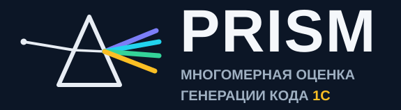
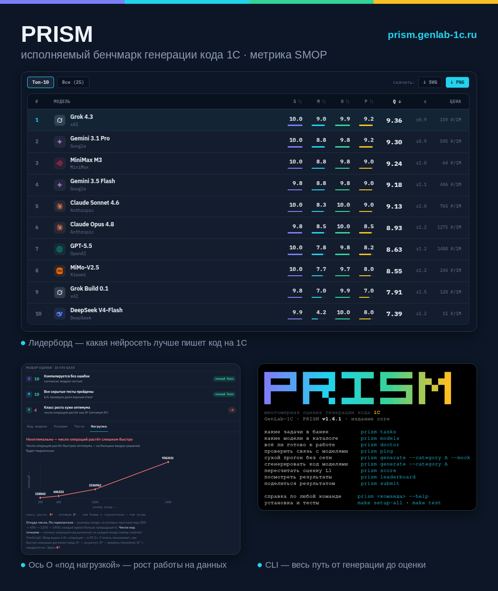

<p align="center">
  <picture>
    <source media="(prefers-color-scheme: dark)" srcset="docs/assets/lockdark.png">
    <source media="(prefers-color-scheme: light)" srcset="docs/assets/locklight.png">
    
  </picture>
</p>

<h1 align="center">PRISM</h1>

<p align="center">
  <b>Исполняемый бенчмарк генерации кода 1С:Предприятие (BSL) с помощью ИИ.</b><br>
  Объективная оценка нейросетей по методике <b>SMOP</b> — Syntax · Meaning · Optimization · Platform.
</p>

<p align="center">
  <a href="https://github.com/genlab-1c/prism/actions/workflows/ci.yml"></a>
  
  <a href="LICENSE"></a>
  
  <a href="https://prism.genlab-1c.ru"></a>
</p>
<p align="center">
<!-- prism:badges -->
  
  
  
  
  
<!-- /prism:badges -->
</p>
<p align="center">
  
  
  
</p>
<p align="center">
  🔍 <b>Живой интерактивный лидерборд</b> — сортировка, сравнение моделей, реальный код по задачам:<br>
  <a href="https://prism.genlab-1c.ru"><b>prism.genlab-1c.ru</b></a>
</p>

---

**PRISM** — открытый бенчмарк, который измеряет, **насколько хорошо ИИ пишет код для
1С:Предприятие 8**. Вместо одной оценки «зачёт/незачёт» он раскладывает качество
сгенерированного нейросетью BSL-кода на четыре оси (как призма раскладывает свет в
спектр) и **проверяет код исполнением** — компилятором, тестами и запуском против конфигурации.

Если вы ищете, **какая нейросеть лучше пишет код на 1С** (Claude, GPT, Gemini, YandexGPT,
GigaChat), занимаетесь **вайбкодингом 1С** или исследуете применимость **ИИ для генерации
кода 1С** — это инструмент, который даёт воспроизводимый, проверяемый ответ, а не
впечатление.

<p align="center">
  <a href="https://prism.genlab-1c.ru">
    
  </a>
</p>
<p align="center"><sub>Лидерборд · разбор оси O «под нагрузкой» · CLI. Живьём и интерактивно — <a href="https://prism.genlab-1c.ru">prism.genlab-1c.ru</a></sub></p>

**Что умеет:**

- **Адаптеры к API моделей** — OpenRouter (Claude, GPT, Gemini, DeepSeek, Qwen, GLM…),
  GigaChat, YandexGPT, любой OpenAI-совместимый (Ollama/vLLM локально); вендор и канал
  доступа разделены — новый провайдер = один файл-адаптер.
- **По-настоящему исполняет код** — OneScript для алгоритмики (A) и headless-1С в Docker
  против синтетической базы для платформенных задач (B).
- **Пробный прогон без сети** (`--mock`) — прогнать весь путь генерация→оценка без ключей и денег.
- **Учёт стоимости** — предполётная смета (`--dry-run`), живой счётчик и кап бюджета
  (`--max-cost`) по датированной таблице цен.
- **Прокси для генерации** (`PRISM_PROXY_RU`/`INTL`) — отдельный для отечественных и зарубежных провайдеров.
- **Надёжность больших прогонов** — чекпойнт и `--resume`, ретраи при сбоях сети, параллелизм.
- **Готовность и связь** — `prism doctor` (инструменты + ключи) и `prism ping` (живая проверка моделей).
- **Шеринг результатов** — `prism submit` пакует прогон с хешем совместимости версии бенчмарка.
- **Срезы по навыкам** — задачи помечены тегами (строки, даты, запрос, метаданные…): видно,
  с чем модель справляется хуже.

> 📌 **Проект в фазе наполнения банка задач.** Точность бенчмарка напрямую зависит от числа
> и разнообразия заданий — поэтому он растёт силами сообщества. Присылайте свои задачи,
> прогоняйте на них модели и исследуйте генерацию кода 1С вместе с нами: каждая задача и
> каждый прогон делают ответ на «какая нейросеть лучше для 1С» честнее.
> **[Как поучаствовать](CONTRIBUTING.md)**


## Зачем это нужно

Популярные бенчмарки кодогенерации (HumanEval, MBPP) для 1С **не работают**:
встроенный язык 1С (BSL) завязан на метаданные конфигурации, русский синтаксис и
платформенные конструкции (регистры, виртуальные таблицы, срезы). Модель может
написать «красивый» код, который компилируется и выглядит верно, но **падает на
первом же реальном запросе к справочнику или регистру**. Обычный `pass/fail` этого
не ловит.

PRISM создан, чтобы дать индустрии 1С честный, открытый ответ на вопросы:
- какая ИИ-модель лучше генерирует код 1С и **в чём именно** (запросы, даты, метаданные…);
- можно ли доверять **вайбкодингу** в 1С и где он ломается;
- как объективно сравнивать LLM для доменно-специфичной платформы.

## SMOP — четыре оси качества

Сгенерированный код мы оцениваем не одной галочкой, а по четырём осям качества сразу —
как призма раскладывает свет в спектр. Главный результат — **вектор** `[S, M, O, P]`, а не
одно число: одно число прячет, *где именно* модель ошиблась.

| Ось качества | Что измеряет | Чем проверяется |
|---|---|---|
| **S** — Syntax (Синтаксис) | компилируется ли модуль | парсер BSL Language Server / компилятор 1С |
| **M** — Meaning (Семантика) | делает ли код то, что просили | исполнение скрытых тестов |
| **O** — Optimization (Оптимальность) | оптимально ли решение (класс роста, антипаттерны) | исполнение: рост числа операций на растущем входе (A) / рост числа обращений к СУБД на растущей базе (B, где есть `perf.yaml`); иначе анализ кода |
| **P** — Platform (Платформа) | корректно ли используются метаданные платформы | исполнение против синтетической базы |

## Как устроено

- **Сначала генерация.** Модель получает условие задачи и пишет код на BSL. Ответы
  фиксируются и сохраняются (`results/`) и хешируются для воспроизводимости — тот же код на
  той же версии правил даёт ту же оценку.

- **Два уровня оценки — одна конституция.**
  - **L1 (машина)** — автооракулы: код компилируется (BSL Language Server / компилятор 1С),
    прогоняется скрытыми тестами и исполняется против базы. Баллы по осям S·M·O·P ставятся
    **строго по протоколу метрики** (конституция SMOP + протокол L1). Быстро и воспроизводимо.
  - **L2 (эксперт)** — *пока в планах*: живой специалист сверяет машину на выборке и судит
    то, у чего нет однозначно верного ответа (выбор подхода, архитектура). Прототип платформы
    экспертной разметки — [genlab-1c-web](https://github.com/4dand/genlab-1c-web). Ключевой
    научный результат — **согласие L1 с экспертом**.

- **Две категории задач.** **A** — алгоритмика на чистом BSL (исполняется в OneScript).
  **B** — платформенные задачи (FIFO, остатки, цены, себестоимость, валюты), которые
  **исполняются в headless-1С против синтетической базы**, собираемой из описания задачи.

- **Эталон гарантирует качество задания.** У каждой задачи есть эталонное решение
  (`canonical`), которое само обязано проходить свои скрытые тесты на 100% — иначе задача не
  попадёт в банк. Так разом проверяются и тесты, и эталон.

- **Срезы по тегам.** Каждая задача помечена навыками и конструкциями 1С (`строки`, `даты`,
  `запрос`, `метаданные`…) — отчёт показывает, **с чем модель справляется лучше, а с чем хуже**.

- **Правило «не измерено ≠ ноль».** Нет инструмента оси — ось честно исключается, а не
  занижает оценку.

> Методика оценки простым языком — **[Как это работает](docs/how-it-works.md)**.

## Быстрый старт

**Что нужно заранее:** **Docker**, **Python 3.10+**, **make**. Для категории B — образ
учебной 1С (`prism-onec`, собирается из своего дистрибутива; как получить — подскажет
`make onec-guide`) и **ключи API** моделей в `.env` (нужны для генерации; для готового
лидерборда — нет).

Окружение управляет [uv](https://docs.astral.sh/uv/) (нет uv? — `curl -LsSf
https://astral.sh/uv/install.sh | sh`; или соберите окружение обычным `python -m venv .venv
&& source .venv/bin/activate && pip install -e .` — тогда `prism` зовётся напрямую). Два
инструмента: **`make`** — *поставить*, **`prism`** — *пользоваться*. Команды `prism` зовутся
через `uv run` — отдельно активировать окружение не нужно, флаги передаются как есть.

```bash
make setup-all            # окружение (uv) + скачает все инструменты + подскажет по учебной 1С для категории B

uv run prism              # точка входа + шпаргалка что делать
uv run prism doctor       # всё ли установлено: инструменты, зависимости и ключи моделей
uv run prism leaderboard  # актуальный лидерборд моделей (мгновенно, без пересчёта значений)
uv run prism check        # целостность контрактов, заданий, эталонов, инструментов
uv run prism score        # запуск исполнения сгененированного кода с пересчетом оценкок L1 уровня
```

Флаги — через тот же `uv run`: `uv run prism score --full`,
`uv run prism generate --category A --models claude`. Полная справка — `uv run prism <команда> --help`.

**Где исполняется код кандидата.** По умолчанию — **в Docker, обе категории**
**A** (алгоритмика) — образ `prism-onescript` + `prism-bsl-ls`, **B** (платформа) — контейнер
учебной 1С `prism-onec` (дистрибутив приносится свой, в репозиторий не попадает; `make
image-onec` проведёт по шагам, см. [`docker/onec.Dockerfile`](docker/onec.Dockerfile)). Все
образы собирает `make setup-all`. Хотите быстрее для своей разработки — хостовый режим
(`make setup` + флаги `--runner local` / `--bsl local`); на баллы режим не влияет, только на
то, где крутится песочница. Проверить готовность — `uv run prism doctor`.

## Свой прогон: от генерации до авто-оценок

Потыкаться руками: подготовить ключи → модели пишут код → считаем баллы.

```bash
# 1. скопируйте шаблон окружения
cp .env.example .env

# 2. впишите в .env ключи провайдеров (.env подхватится автоматически):
# OPENROUTER_API_KEY                — Claude / GPT / Gemini / DeepSeek / Qwen / GLM
# GIGACHAT_AUTH_KEY                 — GigaChat
# YANDEX_API_KEY + YANDEX_FOLDER_ID — YandexGPT

# 3. проверьте готовность
uv run prism doctor                                      # инструменты + ключи
uv run prism ping                                        # пропинговка моделей (съест пару токенов)

# 4. генерация: модели решают задачи - сохранит в results/experiment_*.json
uv run prism generate --category A --mock                # тестовый прогон без сети (проба конвейера, модели не задействованы)
uv run prism generate --category A --models claude       # одна модель, все задачи A
uv run prism generate --category B --models gigachat gpt # несколько моделей сразу и т.д.

# 5. оценка по осям S·M·O·P → лидерборды
uv run prism score                                       # свежий прогон A и B
uv run prism submit                                      # упаковать результат, чтобы поделиться
```

Сегодня гоняем GigaChat, завтра Claude — чтобы сохранить генерации в **тот же** прогон через `--resume` (дозапишет только недостающие пары, то есть прошлые сгенерированные исходники не будут перегенерироваться):

```bash
uv run prism generate --category A --models claude --resume experiment_A_<timestamp>
```

Модели берутся из каталога [`generation/models.yaml`](generation/models.yaml) — это «факты»
о модели: id, вендор, канал доступа (адаптер) и возможности. Чтобы **добавить свою модель**:

1. впишите запись в `generation/models.yaml` (id, `access.adapter`, `capabilities`);
2. задайте числовые параметры в [`generation/params.yaml`](generation/params.yaml)
   (temperature, runs — по записи на каждую модель; это гейтит `prism check`);
3. положите ключ канала в `.env`;
4. если провайдер новый — добавьте файл-адаптер в `harness/generate/adapters/`.

Часть провайдеров в каталоге закомментирована — раскомментируйте нужные. Пошагово (с
примерами) — в [CONTRIBUTING](CONTRIBUTING.md); все флаги команд — в [CLI](docs/cli.md).

## Производительность и железо

Прогоны кандидатов идут **параллельно** (`PRISM_CONCURRENCY`, по умолчанию ≤4) — на баллы
это не влияет (проверено бит-в-бит), только на скорость. По умолчанию код исполняется
**в Docker** (песочница): категория A лёгкая (OneScript в контейнере, доли–единицы секунд
на кандидата), категория B тяжелее — каждый прогон поднимает headless-1С, на практике
**секунды, не минуты** (~10–20 с на кандидата, пустая конфигурация кэшируется); параллелизм
масштабирует по ядрам (напр. 75 B-кандидатов ≈ 5–6 мин в 3 потока).

Грубо по ресурсам:

| | Категория A | Категория B |
|---|---|---|
| Чем считается | OneScript + BSL LS в Docker (`prism-onescript`, `prism-bsl-ls`) | headless-1С в Docker (`prism-onec`) |
| CPU | 2+ ядра | 4+ ядра (≈ по ядру на параллельный прогон) |
| RAM | ~2 ГБ | ~2 ГБ на один параллельный прогон 1С (4 потока ≈ 8–12 ГБ) |
| Прочее | Docker (или хост: `--runner/--bsl local`) | Docker + образ `prism-onec` |

Не хватает памяти — снизьте `PRISM_CONCURRENCY` или задайте лимиты `PRISM_ONEC_MEMORY` /
`PRISM_ONEC_CPUS`. Эти переменные работают **из `.env`** (см. `.env.example`) или как переменные
окружения. При нехватке прогон честно помечается «не измерено», а не выдаёт неверный балл.

## Лидерборды — какая нейросеть лучше пишет код на 1С?

PRISM отвечает на этот вопрос числом, а не мнением. Ниже — результаты. Таблицы
регенерируются из оценок командой `prism docs`.

**Основная сводка — кто лучше в целом.** Доля заданий, решённых **целиком** (код прошёл
**все** скрытые проверки), по двум категориям (🟩 решено целиком · 🟥 нет). Алгоритмические (A)
и платформенные (B) не усредняем — это разные навыки, держим их в отдельных колонках.


<!-- prism:lb:summary -->
<div align="center" markdown>

| № | Модель | Алгоритмика (A) | Платформа 1С (B) |
|:---:|--------|:---|:---|
| 1 | **GPT-5.6 Sol** | 🟩🟩🟩🟩🟩🟩🟩🟩🟩🟩 100% | 🟩🟩🟩🟩🟩🟩🟩🟩🟩🟩 95% |
| 2 | Gemini 3.5 Flash | 🟩🟩🟩🟩🟩🟩🟩🟩🟩🟩 100% | 🟩🟩🟩🟩🟩🟩🟩🟩🟥🟥 85% |
| 3 | Gemini 3.1 Pro | 🟩🟩🟩🟩🟩🟩🟩🟩🟩🟩 100% | 🟩🟩🟩🟩🟩🟩🟩🟩🟥🟥 85% |
| 4 | GPT-5.5 | 🟩🟩🟩🟩🟩🟩🟩🟩🟩🟥 89% | 🟩🟩🟩🟩🟩🟩🟩🟩🟥🟥 75% |
| 5 | MiniMax M3 | 🟩🟩🟩🟩🟩🟩🟩🟩🟥🟥 78% | 🟩🟩🟩🟩🟩🟩🟩🟩🟥🟥 85% |
| 6 | GPT-5.6 Terra | 🟩🟩🟩🟩🟩🟩🟩🟩🟩🟥 89% | 🟩🟩🟩🟩🟩🟩🟩🟥🟥🟥 70% |
| 7 | MiMo-V2.5 Pro | 🟩🟩🟩🟩🟩🟩🟩🟩🟩🟥 89% | 🟩🟩🟩🟩🟩🟩🟩🟥🟥🟥 70% |
| 8 | Claude Sonnet 5 | 🟩🟩🟩🟩🟩🟩🟩🟩🟥🟥 78% | 🟩🟩🟩🟩🟩🟩🟩🟩🟥🟥 80% |
| 9 | Claude Opus 4.8 | 🟩🟩🟩🟩🟩🟩🟩🟥🟥🟥 67% | 🟩🟩🟩🟩🟩🟩🟩🟩🟥🟥 85% |
| 10 | Grok Build 0.1 | 🟩🟩🟩🟩🟩🟩🟩🟩🟥🟥 78% | 🟩🟩🟩🟩🟩🟩🟩🟥🟥🟥 70% |
| 11 | Grok 4.3 | 🟩🟩🟩🟩🟩🟩🟥🟥🟥🟥 56% | 🟩🟩🟩🟩🟩🟩🟩🟩🟩🟥 90% |
| 12 | MiMo-V2.5 | 🟩🟩🟩🟩🟩🟩🟩🟥🟥🟥 67% | 🟩🟩🟩🟩🟩🟩🟩🟥🟥🟥 70% |
| 13 | Claude Sonnet 4.6 | 🟩🟩🟩🟩🟥🟥🟥🟥🟥🟥 44% | 🟩🟩🟩🟩🟩🟩🟩🟩🟥🟥 80% |
| 14 | DeepSeek V4-Flash | 🟩🟩🟩🟩🟩🟩🟥🟥🟥🟥 56% | 🟩🟩🟩🟩🟥🟥🟥🟥🟥🟥 35% |
| 15 | Alice AI LLM Flash | 🟩🟩🟩🟩🟩🟩🟥🟥🟥🟥 56% | 🟩🟩🟩🟩🟥🟥🟥🟥🟥🟥 35% |
| 16 | Qwen3.7 Plus | 🟩🟩🟩🟩🟥🟥🟥🟥🟥🟥 44% | 🟩🟩🟩🟩🟥🟥🟥🟥🟥🟥 40% |
| 17 | GLM-4.7 Flash | 🟩🟩🟩🟥🟥🟥🟥🟥🟥🟥 33% | 🟩🟩🟥🟥🟥🟥🟥🟥🟥🟥 20% |
| 18 | Gemini 2.5 Flash Lite | 🟩🟩🟥🟥🟥🟥🟥🟥🟥🟥 22% | 🟩🟩🟥🟥🟥🟥🟥🟥🟥🟥 25% |
| 19 | GPT-5 Mini | 🟩🟩🟩🟥🟥🟥🟥🟥🟥🟥 33% | 🟥🟥🟥🟥🟥🟥🟥🟥🟥🟥 5% |
| 20 | Qwen3-235B-A22B | 🟩🟩🟥🟥🟥🟥🟥🟥🟥🟥 22% | 🟩🟥🟥🟥🟥🟥🟥🟥🟥🟥 10% |
| 21 | GPT-OSS 120B | 🟩🟩🟥🟥🟥🟥🟥🟥🟥🟥 22% | 🟩🟥🟥🟥🟥🟥🟥🟥🟥🟥 10% |
| 22 | Alice AI LLM | 🟩🟩🟥🟥🟥🟥🟥🟥🟥🟥 22% | 🟩🟥🟥🟥🟥🟥🟥🟥🟥🟥 10% |
| 23 | Qwen3.6-35B-A3B | 🟩🟥🟥🟥🟥🟥🟥🟥🟥🟥 11% | 🟩🟥🟥🟥🟥🟥🟥🟥🟥🟥 10% |
| 24 | YandexGPT 5 Lite | 🟩🟥🟥🟥🟥🟥🟥🟥🟥🟥 11% | 🟥🟥🟥🟥🟥🟥🟥🟥🟥🟥 5% |
| 25 | YandexGPT 5 Pro | 🟥🟥🟥🟥🟥🟥🟥🟥🟥🟥 0% | 🟩🟥🟥🟥🟥🟥🟥🟥🟥🟥 10% |
| 26 | YandexGPT 5.1 Pro | 🟥🟥🟥🟥🟥🟥🟥🟥🟥🟥 0% | 🟩🟥🟥🟥🟥🟥🟥🟥🟥🟥 10% |
| 27 | GigaChat 2 Max | 🟥🟥🟥🟥🟥🟥🟥🟥🟥🟥 0% | 🟩🟥🟥🟥🟥🟥🟥🟥🟥🟥 10% |
| 28 | GigaChat 2 Pro | 🟥🟥🟥🟥🟥🟥🟥🟥🟥🟥 0% | 🟥🟥🟥🟥🟥🟥🟥🟥🟥🟥 0% |
| 29 | GigaChat 2 Lite | 🟥🟥🟥🟥🟥🟥🟥🟥🟥🟥 0% | 🟥🟥🟥🟥🟥🟥🟥🟥🟥🟥 0% |

</div>
<!-- /prism:lb:summary -->

> 📊 **Полные таблицы** — баллы по осям S·M·O·P, разбор «где ломается код» и профиль по навыкам —
> в интерактивном виде на сайте: **[prism.genlab-1c.ru](https://prism.genlab-1c.ru)**
> (сортировка, сравнение моделей, реальный код по каждой задаче).

Видно **с чем именно** у модели лучше и хуже: DeepSeek ровно силён в алгоритмах, строках и
коллекциях (A) и единственный уверенно держит платформорменный показатель (P) 1С (B); все проседают на коллекциях; Gemini
на платформе нулевой.

## Структура репозитория

```
metrics/     правила метрики SMOP — как из запуска кода получается балл по каждой оси
             (только настройки в YAML, без кода)
tasks/       сами задания: условие + скрытые тесты + эталонное решение.
             category_a/ — алгоритмика (чистый 1С) · category_b/ — платформенные (запуск в 1С)
harness/     код бенчмарка: сгенерировать код моделями, оценить по осям S·M·O·P,
             запустить в OneScript и headless-1С, посчитать статистику
generation/  с кем и как работаем: список моделей, их параметры, системные промпты
results/     что получилось: сырые ответы моделей и автоматические оценки
docs/        документация (та, что ты сейчас читаешь)
```

## Статус

**Релиз, активная разработка.** Автооценка L1 (машинная) работает для обеих категорий:
**A** — оси S/M/O, **B** — M/P против синтетической базы; эталоны гейтятся в `prism check`.
L2 (эксперт) — *пока в планах* (прототип — [genlab-1c-web](https://github.com/4dand/genlab-1c-web)).
Банк задач в фазе наполнения: рейтинг крепнет с ростом числа и разнообразия заданий.
Дорожная карта и честные границы — [`docs/status.md`](docs/status.md) и
[`docs/validity.md`](docs/validity.md).

## Участие

Самый ценный вклад — **новые задачи**: чем шире и разнообразнее банк, тем точнее рейтинг.
Можно также добавить **модель** в лидерборд или прислать свой готовый прогон (`prism submit`).
Пошагово, с примерами — в [`CONTRIBUTING.md`](CONTRIBUTING.md).

## Документация

Вся документация — в [`docs/`](docs/) (сайт на MkDocs Material). Читать локально одной
командой — **`make docs-serve`** (live-предпросмотр на http://127.0.0.1:8000; если порт занят
— `make docs-serve DOCS_ADDR=127.0.0.1:8001`); собрать статику — `make docs-build` (в `site/`).

**Начать отсюда [Обзор](docs/index.md)** — что такое PRISM и куда смотреть дальше. Затем:

- [Как это работает](docs/how-it-works.md) — методика SMOP простым языком
- [Как участвовать](CONTRIBUTING.md) — добавить задачу/модель, дисциплина, PR-процесс
- [Состояние бенчмарка](docs/status.md) — что умеет, чем подтверждено, потолок
- [Границы и валидность](docs/validity.md) — что инструмент вправе утверждать, а что нет
- [Архитектура и поток данных](docs/architecture.md) — устройство и режимы исполнения
- [CLI `prism`](docs/cli.md) — установка и все команды

## Благодарности

PRISM стоит на плечах open-source инструментов сообщества 1С — без них исполняемой
оценки не было бы:

- **[BSL Language Server](https://github.com/1c-syntax/bsl-language-server)** (проект
  `1c-syntax`) — статический анализ кода для осей **S** и **O**.
- **[OneScript](https://oscript.io/)** — движок языка 1С, на котором исполняются задачи
  категории A (ось **M**).
- **[YAXUNIT](https://github.com/firstBitMarksistskaya/yaxunit)** — модульное тестирование
  в 1С (целевой формат проверок категории B).
- **[1C-MCP](https://github.com/vladimir-kharin/1c_mcp)** (Владимир Харин) — MCP-серверы
  в 1С: доступ ИИ к метаданным конфигурации, на котором держатся контекст-режим и будущее
  агентное издание.
- **[onec-community-docker](https://github.com/alexandermyasnikov123/onec-community-docker)**
  (Александр Мясников) — докеризация 1С, опора для headless-исполнения категории B в контейнере.
- **Сообщество 1С и [Infostart](https://infostart.ru/)** — за экспертизу, обратную связь
  и культуру, в которой такой инструмент вообще имеет смысл.

Отдельная признательность всем, кто присылает **новые задачи** — именно из них и растёт
ценность бенчмарка.

## Происхождение

PRISM вырос из научно-исследовательской работы «Экспериментальная оценка эффективности ИИ в генерации
кода для доменно-специфичных платформ (на примере 1С:Предприятие 8)» (Андреев Д.С.,
март 2026) — [репозиторий статьи](https://github.com/4dand/1c-ai-codegen-research-paper).
Концепт самой методики SMOP и вычислительное ядро (core) взяты оттуда и переработаны в исполняемый бенчмарк.

## Цитирование

Если PRISM пригодился в исследовании или продукте — сошлитесь на проект. Машиночитаемые
метаданные лежат в [`CITATION.cff`](CITATION.cff) (GitHub покажет кнопку
«Cite this repository»).

> Андреев Д. С. PRISM — исполняемый бенчмарк кодогенерации 1С (методика SMOP). 2026.
> https://github.com/genlab-1c/prism

## Лицензия

[MIT](LICENSE) — свободно используйте, изменяйте и распространяйте, сохраняя уведомление
об авторстве.

---

<sub><b>Темы:</b> 1С ИИ · ИИ для 1С · генерация кода 1С нейросетью · генератор кода 1С на ИИ ·
вайбкодинг 1С · бенчмарк нейросетей 1С · оценка качества кода 1С · какая нейросеть лучше для 1С ·
сравнение LLM для 1С · исследование ИИ для 1С · LLM для 1С:Предприятие 8 · встроенный язык 1С (BSL) ·
нейросеть для программиста 1С · ИИ-ассистент разработчика 1С · автоматизация разработки 1С с ИИ ·
GigaChat · YandexGPT · DeepSeek · Qwen · GLM · Claude · GPT · Gemini для 1С · метрика SMOP.</sub>

<sub><b>Topics (GitHub):</b> 1c · 1c-enterprise · bsl · onescript · llm · llm-benchmark ·
code-generation · ai-code-generation · llm-evaluation · benchmark · gigachat · yandexgpt ·
deepseek · vibe-coding · smop · russian-llm</sub>
