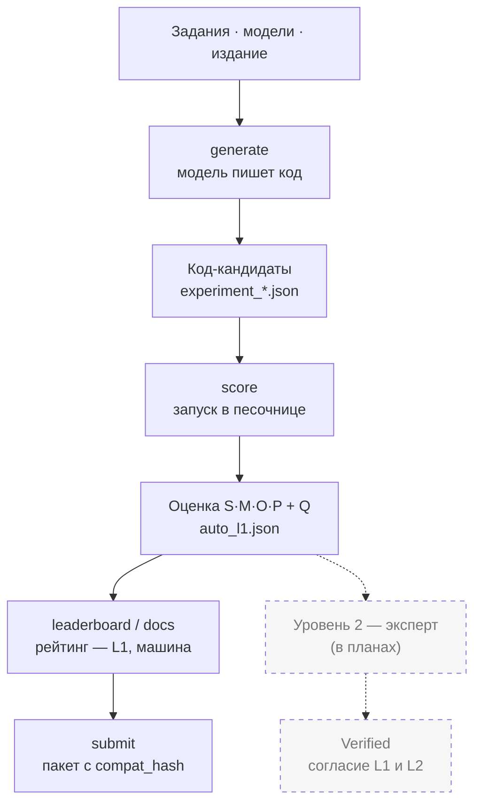

# Архитектура

Эта страница — для тех, кто хочет заглянуть внутрь: разработчиков и тех, кто думает
дополнять бенчмарк. Нужна просто методика — она на странице
[Как это работает](how-it-works.md).

## Данные и код

Репозиторий делится на **данные** (правда о том, что и как мы меряем) и **код** (инструмент,
который это исполняет).

**Данные — что и как оценивать:**

| Каталог | Что лежит |
|---|---|
| `metrics/` | правила метрики SMOP: общие определения осей (конституция) + как их считает машина и как ставит эксперт (два протокола) |
| `tasks/` | сами задания: условие, скрытые тесты, эталон; для платформенных — ещё и описание учебной базы |
| `editions/` | профили прогона: какие оси считать и в каких условиях решала модель |
| `generation/` | с какими моделями работаем: каталог моделей, их числовые параметры, системные промпты, таблица цен |

**Код — чем оценивать (папка `harness/`):**

| Модуль | За что отвечает |
|---|---|
| `generate/` | модели пишут код по задачам: адаптеры провайдеров, агентный сбор метаданных (категория B), чекпойнт/`--resume`, ретраи, учёт бюджета, офлайновая имитация `--mock` |
| `score/` | оценка кода по осям S · M · O · P и общий балл Q (по модулю на ось) |
| `execute/` | запуск кода в песочнице: OneScript (категория A), headless-1С (B), BSL LS (оси S/O), сборка учебной базы из описания |
| `stats/` | срезы по тегам и согласие машины с экспертом |
| `report/` | генерация таблиц лидерборда и банка задач (`prism docs`, `prism tasks`) |
| `preflight`, `submit` | предполётные проверки (`doctor`, `ping`) и упаковка прогона для шеринга (`submit`) |

Сверху — тонкая обвязка: `cli` (разбор команд), `orchestrate` (прогон оценки), `check`
(целостность), `loaders`/`settings` (чтение данных и ключей). Логики в диспетчере нет — он
только связывает слои.

## Метрика: одна конституция, два протокола

Сердце бенчмарка — каталог `metrics/`:

- **`smop.yaml` — конституция.** Определяет сами оси (S, M, O, P), шкалу баллов и правило
  общего балла Q. Это «что мы меряем» — менять осознанно, это затрагивает все результаты.
- **`smop_l1_auto.yaml` — протокол Уровня 1 (машина).** Как из запуска кода получается балл:
  пороги, банды, белые списки. Скореры в `harness/score/` читают пороги **отсюда**, не
  хардкодят.
- **`smop_l2_expert.yaml` — протокол Уровня 2 (эксперт).** Как тот же набор осей оценивает
  живой человек.

Ключевая идея: **оба уровня меряют одно и то же** (по одной конституции) — различаются только
протоколы. Поэтому их оценки сравнимы, и главный научный результат проекта — **согласие L1 с
L2** (каппа Коэна).

## Задача = условие + скрытая проверка + эталон

Каждая задача — самодостаточный каталог. Состав зависит от категории:

| Файл | Категория A (алгоритмика) | Категория B (платформа) |
|---|---|---|
| `task.yaml` | условие, точка входа, теги | условие, паттерны функции, ожидаемые объекты, теги |
| тесты | `tests.yaml` (скрытые кейсы) | `tests.bsl` (проверки на BSL) |
| эталон | `canonical.bsl` | `canonical.bsl` |
| оптимальность | `perf.yaml` (генератор растущего входа) | — |
| учебная база | — | `config_spec.yaml` + `fixtures.yaml` (синтетическая конфигурация и данные) |

Инвариант: **эталон обязан проходить свои скрытые тесты на 100%** — иначе сломаны тесты или
эталон. Это и гейтит `prism check`. Для категории B база целиком воссоздаётся из
`config_spec.yaml` + `fixtures.yaml` при каждом прогоне (в репозиторий база не попадает).

## Каталог моделей и адаптеры

**Модель — это факты, канал доступа — отдельно.** В `generation/models.yaml` модель описана
фактами: id, вендор, возможности (окно контекста, поддержка инструментов). А как до неё
достучаться — поле `access.adapter`: один и тот же вендор может идти разными каналами (Claude
через OpenRouter, Qwen — локально через Ollama).

- `models.yaml` — каталог моделей (факты);
- `params.yaml` — числовые параметры прогона (temperature, число прогонов) по модели;
- `prompts.yaml` — системные промпты по категории;
- `pricing.yaml` — датированная таблица цен (волатильна, поэтому отдельно от каталога).

Добавить нового провайдера = один файл-адаптер в `harness/generate/adapters/` плюс запись в
каталоге. Остальной код не трогается.

## Издания — «в каких условиях испытывали»

**Издание** (`editions/`) — профиль прогона: какие оси считаем и при каких условиях модель
решала задачу. Один и тот же набор задач можно прогнать по-разному:

- **core** (есть сейчас) — модель получает задание и пишет код; для платформенных задач сама
  собирает нужные сведения о базе (метаданные) вызовами инструментов;
- **agent** (в планах) — полный агентный цикл: модель не просто пишет код, а сама правит
  конфигурацию инструментами и проверяет результат.

Издание отвечает на вопрос «*в каких условиях* испытывали», а не «*кто проверил* результат».
«Проверено экспертом» (Verified) — это отдельное измерение, не издание.

## Поток данных: от задачи до оценки

Пунктиром — Уровень 2 (эксперт): он пока в планах. Категория B перед генерацией сама
собирает метаданные базы; подробности по шагам — в разделах выше.

## Где исполняется код: docker и local

Код кандидата нужно запустить, и есть два режима:

- **docker** (по умолчанию) — код запускается в изолированном контейнере: без доступа к сети,
  с лимитами по памяти и времени, файлы только для чтения. Это дефолт, потому что код от
  нейросети недоверенный — ему не место на хосте без песочницы. Так же гоняется и в CI.
- **local** — инструменты стоят на твоём компьютере. Быстрее, удобно для своей разработки;
  включается явно (`--runner local` / `--bsl local` или `PRISM_RUNNER=local`).

Важно: **способ запуска на оценку не влияет** — инструмент той же версии, балл тот же. Поэтому
режим это инфраструктура, а не часть результата (не входит в «версия × издание × конфиг»).
Выбор — через `PRISM_RUNNER` / `PRISM_BSL` (по умолчанию `docker`).

## Что сохраняется в results/

- **`experiment_*.json`** — сырые ответы моделей (что именно сгенерировала каждая модель на
  каждой задаче), с хешами для анализа воспроизводимости. Каноничны, идут в репозиторий.
- **`auto/*_auto_l1.json`** — авто-оценки Уровня 1: производная из сырых ответов + протокола.
  Воспроизводимы пересчётом (`prism score`), поэтому в репозиторий **не** коммитятся.
- **`submissions/`** — упакованные прогоны для шеринга (`prism submit`): оценки + `compat_hash`
  (отпечаток версии бенчмарка — метрика и набор задач). Хеш гарантирует, что чужой прогон
  получен на той же версии и его цифры сравнимы.

## Документация — производные данные

Таблицы лидерборда и счётные бейджи в README и на сайте — **не пишутся руками**. Их источник
правды — `results/auto/*_auto_l1.json`; `prism docs` подменяет помеченные регионы между
`<!-- prism:KEY -->` свежими данными. Так проза и числа не разъезжаются.

## Операционная надёжность ⟂ метрика

Чекпойнт/`--resume`, ретраи при сбоях сети, учёт стоимости, параллельный запуск — всё это
нужно для больших прогонов, но на баллы SMOP **не влияет**: балл считается из ответа модели,
а не из того, как и почём он получен. Параллельный скоринг (`PRISM_CONCURRENCY`) проверен
бит-в-бит против последовательного — баллы совпадают.

## Дальше

- **[Как это работает](how-it-works.md)** — методика простым языком.
- **[Как запустить](cli.md)** — установка и все команды.
- **[Честные границы](validity.md)** — что инструмент вправе утверждать, а что пока нет.
